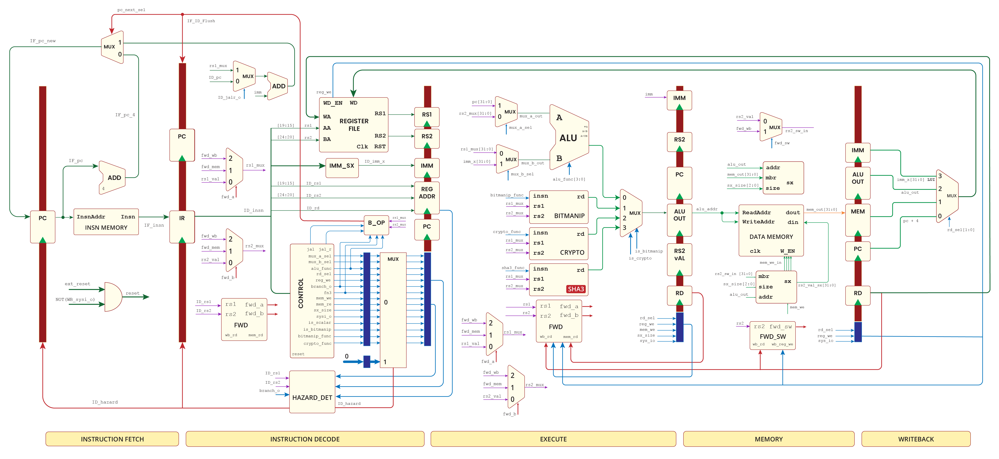

  

  A 32-bit single-core pipelined RISC-V processor with cryptographic and bit-manipulation support, ASIC-ready and optimized for SHA-3 acceleration.

---

## 🚀 About the Project

This is a Verilog-based implementation of a 32-bit RISC-V processor supporting the RV32I instruction set architecture with extensions for cryptographic and bit-manipulation operations. The processor is designed with a classic 5-stage pipeline and includes **4 custom instructions** to accelerate SHA-3 hashing.

### Key Highlights:
- **71 standard RISC-V instructions** implemented (RV32I subset)
- **4 custom SHA-3 instructions**:
  - Accelerate `XOR5` operation and 64-bit word rotation — key components of the SHA-3 algorithm
  - Achieve a **2.68× speedup** over using only Zkn/Zks cryptographic extensions for SHA-3 block processing
- **Single-core, 5-stage pipelined processor**
- **Written entirely in Verilog HDL**

### Instruction Support:
- **Standard ISA:** RV32I (Unprivileged subset)
- **Not implemented:** CSR, `FENCE`, `FENCE.I`, `ECALL`, `EBREAK`, Privileged ISA
- **Extensions:**
  - **K Extension** – Experimental support for Zkn and Zks (Bit-manipulation and cryptographic instructions)
  - **Custom SHA-3 instructions**

---

## 🛠️ ASIC Implementation

The RTL design has been synthesized and taken through a complete ASIC physical design flow using **Cadence® tools** on a **45nm technology node**, under multiple operating conditions.

### Implementation Details:
- **Design Flow:** Semi-custom ASIC flow  
- **Tools:** Industry-standard Cadence® toolchain  
- **Technology:** 45nm slow and fast libraries  
- **Clock Frequency:** Evaluated at multiple operating frequencies, including 100 MHz  
- **Performance Metrics:**
  - Area, Power, Timing, and Delay reports generated post-synthesis  
  - At 100 MHz, **minimum power consumption recorded: 915.860 μW**

---

### 🖼️ Pipeline Diagram

  

### 🧿 Layout

  

  <em>Figure: Physical Design Layout of the proposed processor with SHA-3 acceleration unit using 45nm technology</em>

---

## 📈 Future Scope

- Full implementation of the **Privileged ISA**
- Peripheral support: **GPIO**, **LED**, and **UART**
- Pipeline optimizations and extended support for ratified K-extension specs

---

## 📚 Final Year Thesis

**Authors:**  
- Paulson K Antony – 17BEC1147  
- Nikshith Narayan Ramesh – 17BEC1097  
- Pranav Suryadevara – 17BEC1073  

**Guide:**  
Prof. Prathiba A

---

**Vellore Institute of Technology, Chennai Campus**  
Vandalur–Kelambakkam Road,  
Chennai – 600127

---

## 📖 Citation

If you use this project or refer to the design in your work, please cite the following publication:

> P. K. Antony, N. N. Ramesh, P. Suryadevara, and P. A,  
> **"RISC-V Processor Hardware Modelling with Custom Instruction Set for SHA-3 Acceleration"**,  
> in *Resilient Community Microgrids*,  
> John Wiley & Sons, Inc.; Scrivener Publishing LLC, 2025, pp. 189–213.

---

## 📄 License

This project is licensed under the [MIT License](LICENSE).
